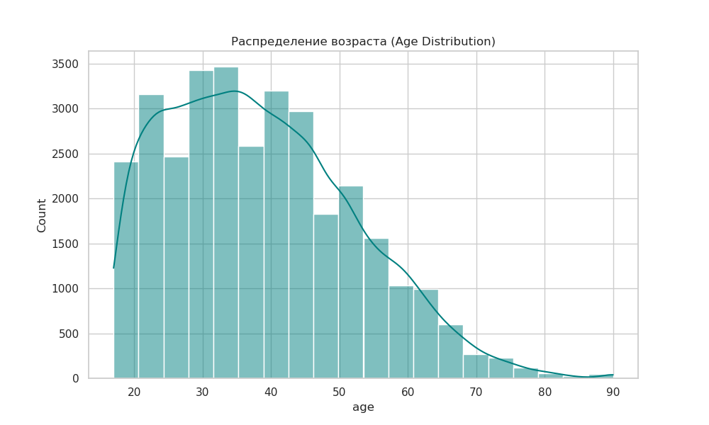
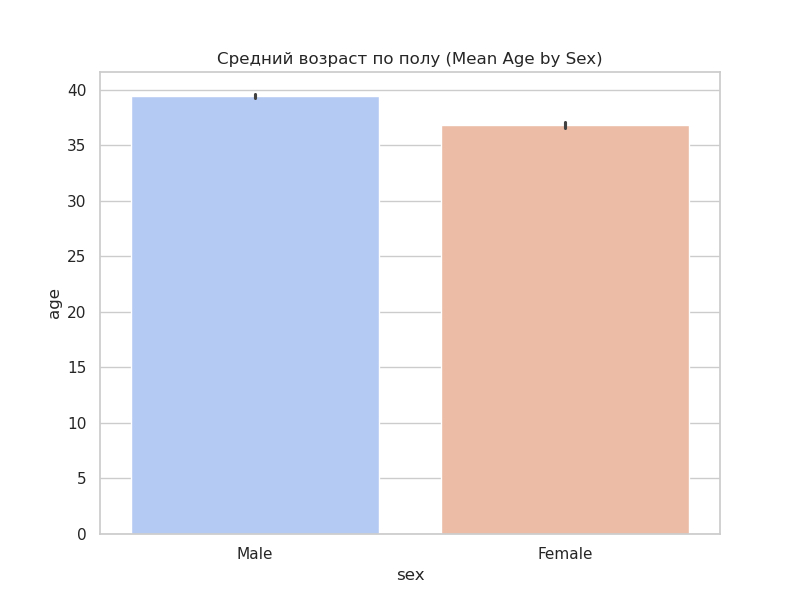
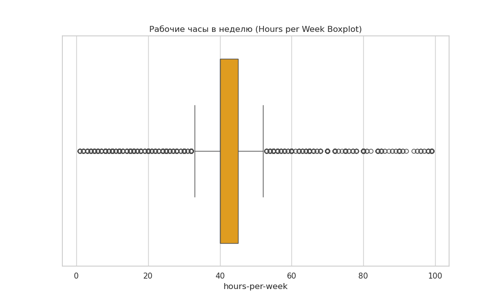
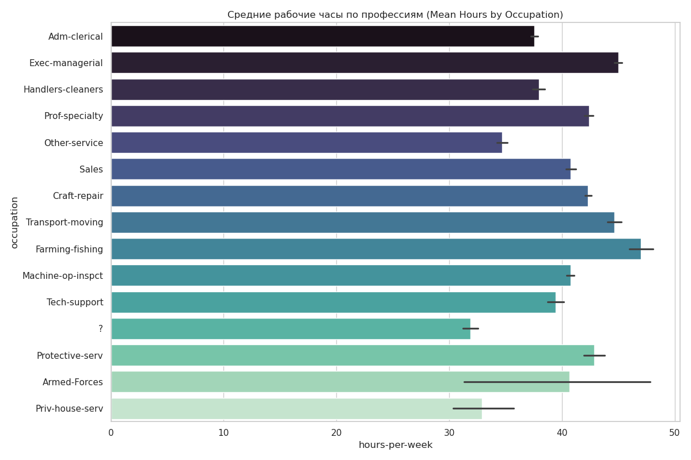
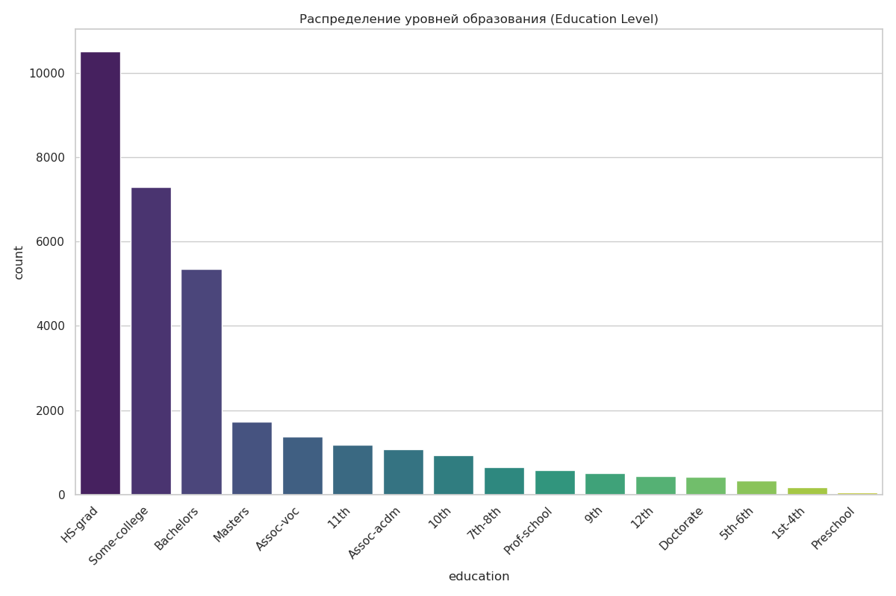
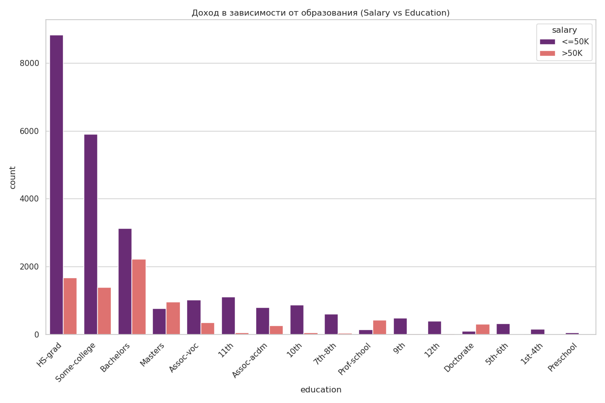
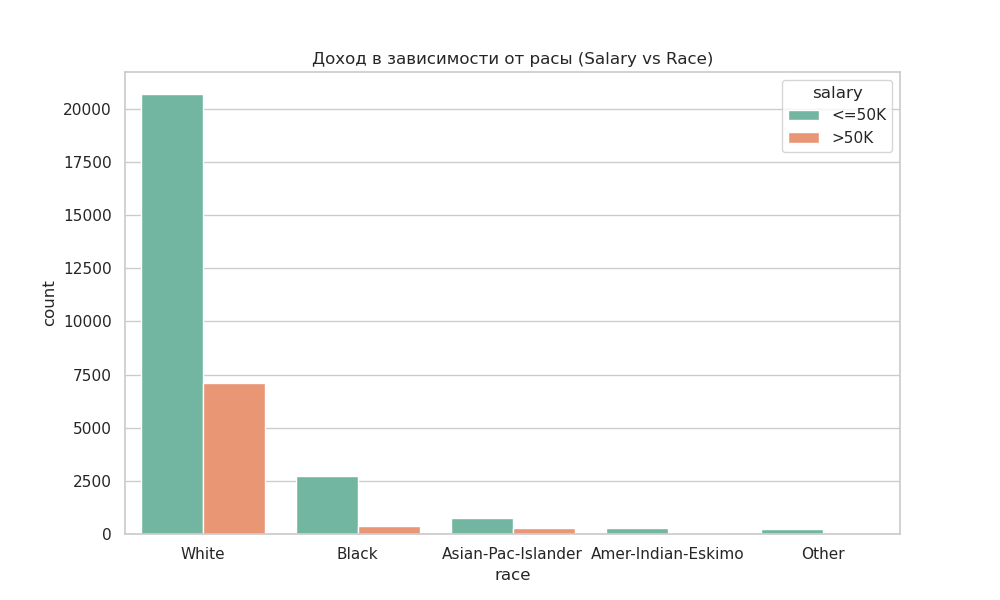

# Лабораторная работа №1: Исследовательский анализ данных переписи (Census Income)
---

## 🎯 Общее представление проекта (Overview)
Данный проект представляет собой комплексный статистический анализ набора данных «Census Income» (Перепись населения). Основная задача — изучить, как демографические факторы (возраст, пол, раса) и уровень образования влияют на экономическое благосостояние (уровень дохода свыше или ниже 50 000$ в год).

---

## 📊 Результаты визуального анализа

### Группа 1: Демография
*   **Возраст (`1_age_dist.png`):** Анализ распределения показал, что основная рабочая сила сосредоточена в возрасте 30-45 лет. Распределение имеет «правый хвост», что типично для данных о населении.

*   **Пол и возраст (`3_mean_age_sex.png`):** Выявлено, что средний возраст работающих мужчин в выборке выше, чем у женщин.


### Группа 2: Трудозатраты
*   **Рабочая нагрузка (`4_hours_boxplot.png`):** Большинство работает стандартные 40 часов, но боксплот выявил значительное количество «аномалий» — людей, работающих более 60-80 часов в неделю.

*   **Профессии (`7_hours_occupation.png`):** Самые длинные рабочие недели зафиксированы у топ-менеджеров (`Exec-managerial`) и в сельском хозяйстве.


### Группа 3: Образование и Доход (Ключевые инсайты)
*   **Образование (`2_education_dist.png`):** Доминирующая группа — `HS-grad`, однако они редко попадают в категорию высокого дохода.

*   **Зависимость дохода от образования (`5_salary_education.png`):** **Критический вывод:** Наличие степени Bachelors, Masters или Doctorate радикально (в 3-4 раза) повышает шансы на попадание в группу с доходом >50K.

*   **Расовый признак и доход (`6_salary_race.png`):** График иллюстрирует текущее распределение материальных благ между различными расовыми группами в выборке.


---

## 📈 Сводные данные и консольный вывод

Скрипт выводит в консоль сводную статистику, которая подтверждает визуальные данные:

### 1. Описательная статистика
```text
Descriptive Statistics (Age, Hours):
                age  hours-per-week
count  32561.000000    32561.000000
mean      38.581647       40.437456
std       13.640433       12.347429
min       17.000000        1.000000
50%       37.000000       40.000000
max       90.000000       99.000000
```
**Пояснение:** Средний возраст в выборке составляет 38.5 лет, а среднее рабочее время — 40.4 часа. Максимальный возраст респондента — 90 лет.

### 2. Сводная таблица (Mean Age by Education & Sex)
```text
sex              Female       Male
education                         
Bachelors     35.635578  40.321734
Doctorate     45.325581  48.327217
Masters       43.074627  44.490312
HS-grad       38.678171  39.115736
```
**Пояснение:** Данный вывод (Pivot Table) показывает, что мужчины со степенью бакалавра в среднем на 5 лет старше женщин с тем же образованием. Это важный демографический инсайт.

---

## 🛡️ Ответы на защите (Cheat Sheet)

1.  **«Почему именно этот код?»** — «Я использовал векторные операции Pandas, что позволяет обрабатывать десятки тысяч строк мгновенно, не используя медленные циклы».
2.  **«Как вы интерпретируете график 5?»** — «Этот график (Salary vs Education) наглядно доказывает теорию человеческого капитала: инвестиции в высшее образование конвертируются в высокую вероятность попадания в верхний квантиль доходов».
3.  **«Что дает Boxplot (график 4)?»** — «Он позволяет увидеть медиану и квартили распределения рабочих часов, а также отсечь статистические выбросы».

---
**Файлы графиков сохранены автоматически в папку `lab_1_census_analysis/`.**
