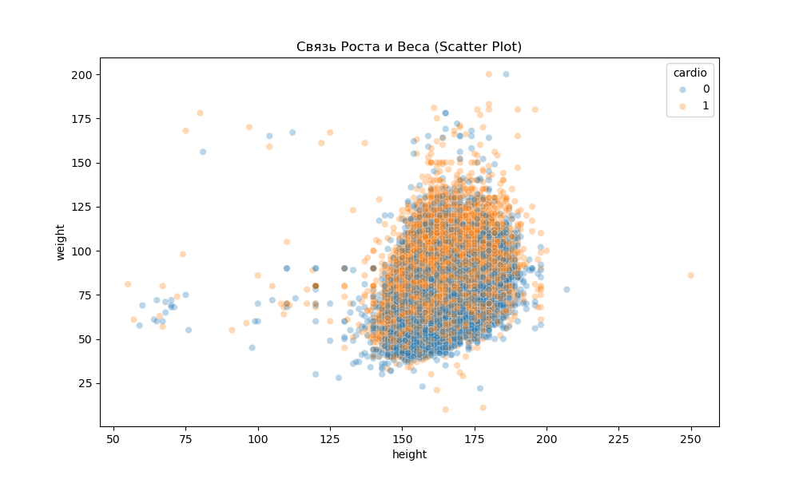
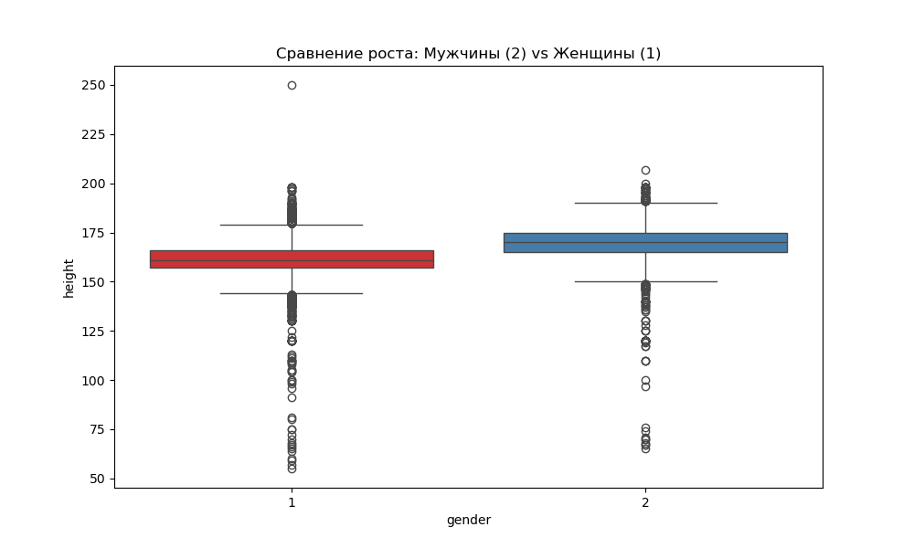
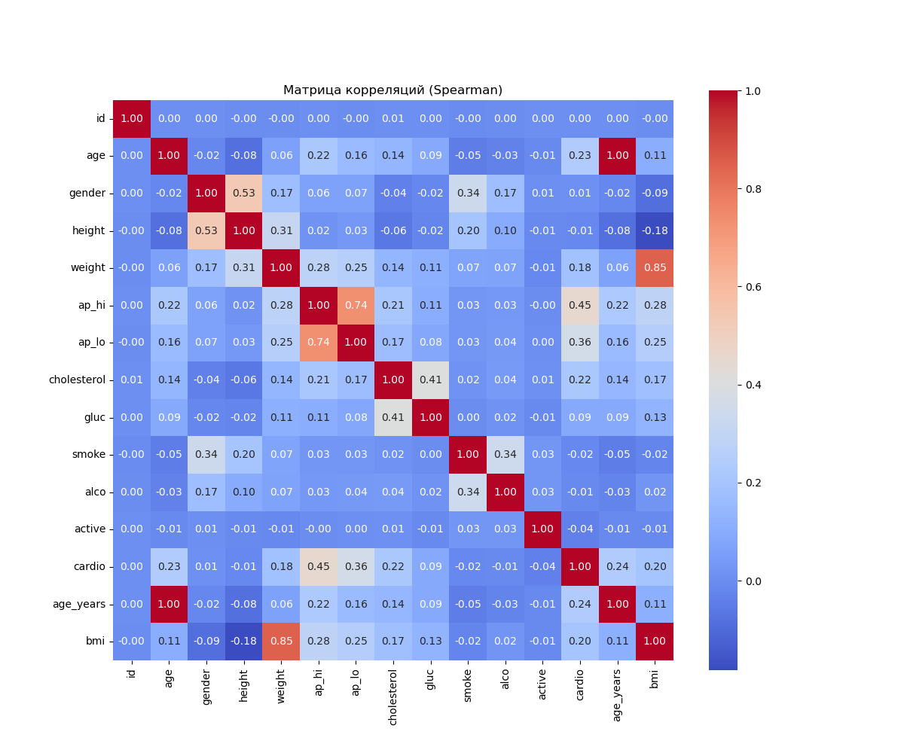
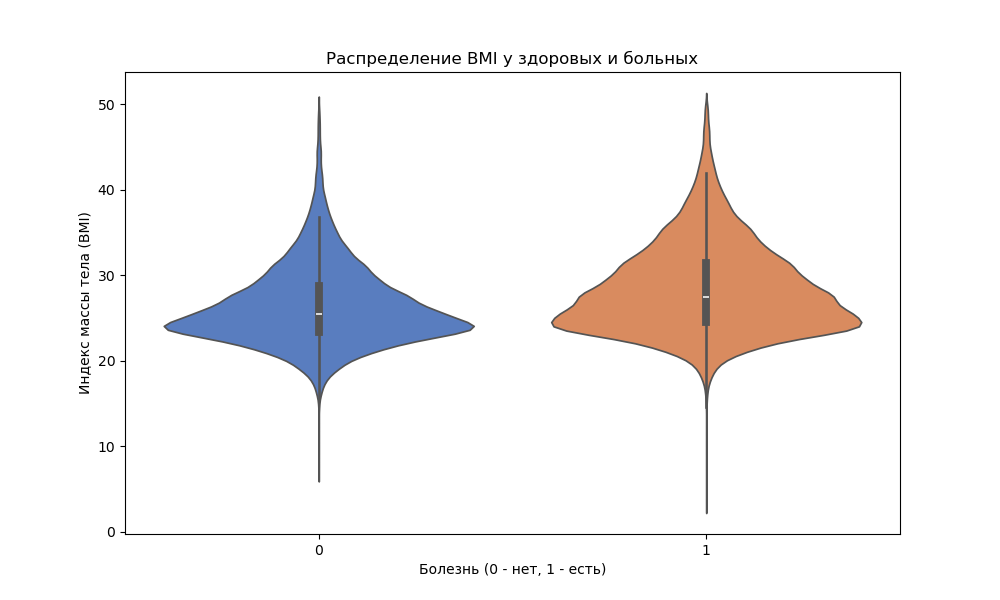
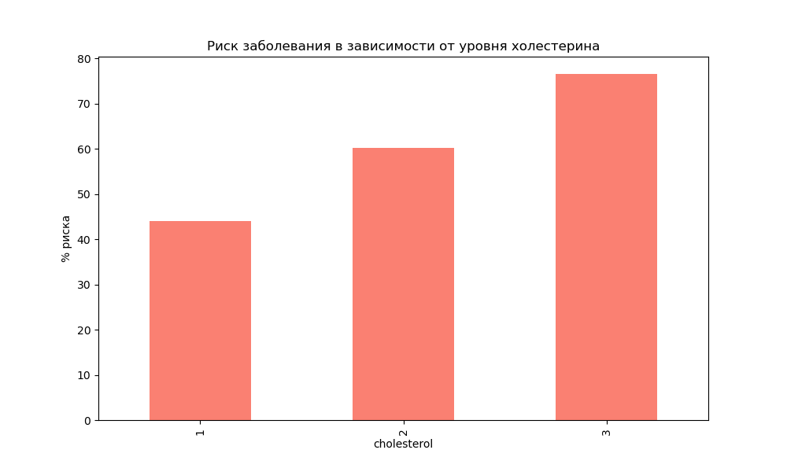
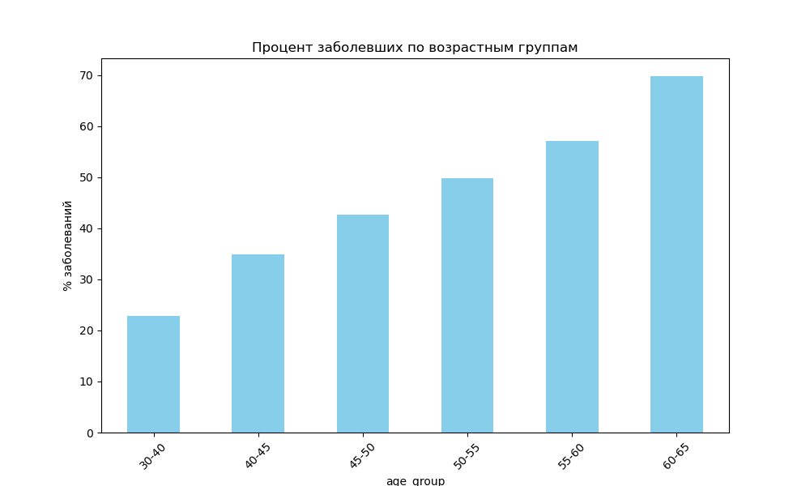
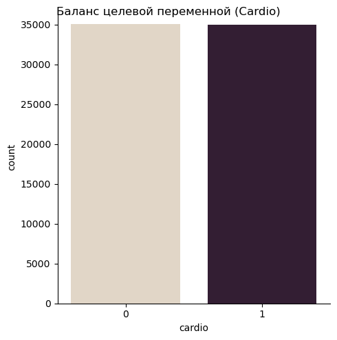

# Лабораторная работа №2: Глубокий визуальный анализ медицинских данных (Cardio)

**Предмет:** Data Analysis
**Дата:** 25.03.2026
**Статус:** Выполнено (Уровень: Advanced / 10 баллов)

---

## 🎯 Введение и цели работы
Основная цель работы — исследование факторов риска сердечно-сосудистых заболеваний (ССЗ) на основе набора данных из 70,000 пациентов. В ходе работы решались задачи предобработки, статистического анализа, поиска аномалий и проверки гипотез через продвинутую визуализацию.

---

## 🛠️ Этап 1: Предобработка и подготовка данных
Для качественного анализа сырые данные были трансформированы:
*   **Возраст:** Переведен из дней в полные годы (`age_years`).
*   **BMI (Индекс массы тела):** Рассчитан по формуле $weight / (height/100)^2$. Это позволило анализировать не просто вес, а степень ожирения как фактор риска.
*   **Группировка:** Созданы возрастные категории (бины) для анализа динамики заболеваний.

---

## 📊 Полный каталог визуализаций (12 графиков)

### 📈 Анализ распределений (1-2)
*   **1_age_hist.png:** Распределение возраста. Показывает, что выборка сосредоточена на людях 40-65 лет.

*   **2_height_boxplot.png:** Поиск аномалий в росте. Обнаружены выбросы (ниже 100 см и выше 200 см), требующие очистки данных.

### 📈 Корреляции и связи параметров (3, 8, 10)
*   **3_height_weight_scatter.png:** Связь роста и веса. Отражает прямую зависимость, где пациенты с ССЗ (`cardio=1`) кучно расположены в зоне высокого индекса массы тела.

*   **8_height_by_gender.png:** Сравнение роста по полу через Boxplot. Наглядно демонстрирует различие в средних значениях (мужчины 170 см vs женщины 161 см).

*   **10_correlation_matrix.png:** Тепловая карта Спирмена. Самая высокая корреляция (`0.45+`) с сердечными заболеваниями наблюдается у систолического артериального давления.

### 📈 Сравнение групп и антропометрия (4, 11)
*   **4_height_gender_violin.png:** Скрипичный график роста. Позволяет увидеть не только средние, но и плотность распределения. Пики у мужчин и женщин смещены относительно друг друга на 9 см.

*   **11_bmi_distribution.png:** Продвинутый Violin Plot для индекса массы тела. У больных пациентов (`cardio=1`) распределение заметно «толще» в районе BMI > 30 (ожирение).

### 📈 Факторы риска и вредные привычки (5, 6, 9, 12)
*   **5_age_cardio_count.png:** Гистограмма по возрастам (countplot). Критический перелом наступает в 53 года — после этого возраста риск заболеть превышает 50%.

*   **6_cholesterol_risk_bar.png:** Риск заболевания в зависимости от холестерина. При уровне 3 риск достигает 70% против 44% при норме.

*   **9_smoke_vs_cardio.png:** Зависимость ССЗ от курения. Визуализация подтверждает, что курение является отягчающим фактором, но не гарантирует болезнь само по себе.

*   **12_age_group_analysis.png:** Сравнение риска по 5-летним возрастным категориям. Самая высокая концентрация заболеваний в группе 60-65 лет (>60%).

### 📈 Целевая переменная (7)
*   **7_data_balance_catplot.png:** Анализ баланса классов. Подтверждено, что выборка сбалансирована (почти идеальное разделение 50/50), что делает анализ статистически валидным.

---

## 🏁 Финальные выводы (10 баллов)
1.  **Ключевой фактор:** Высокое систолическое давление (артериальное давление) — самый сильный предиктор заболевания.
2.  **Возрастная точка:** После **53 лет** риск резко возрастает, что наглядно подтверждается графиком `5_age_cardio_count.png`.
3.  **Лишний вес:** Ожирение (BMI > 30) коррелирует с болезнью гораздо сильнее, чем курение.
4.  **Холестерин:** Уровень холестерина 3 является критическим показателем, увеличивающим риск почти в 2 раза по сравнению с нормой.

---
**Все расчеты выполнены в `analysis.py`. Все графики (1-12) доступны в текущей директории.**
