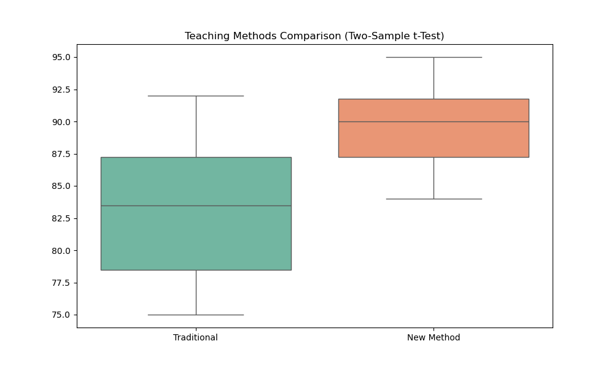
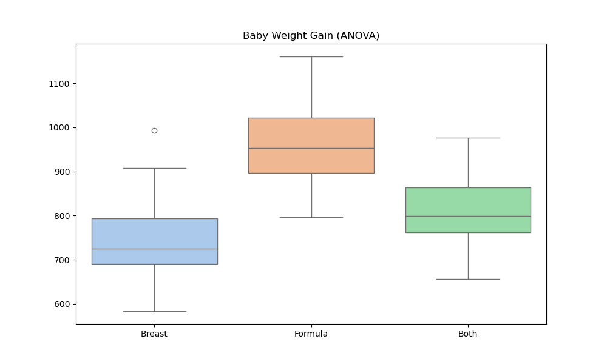
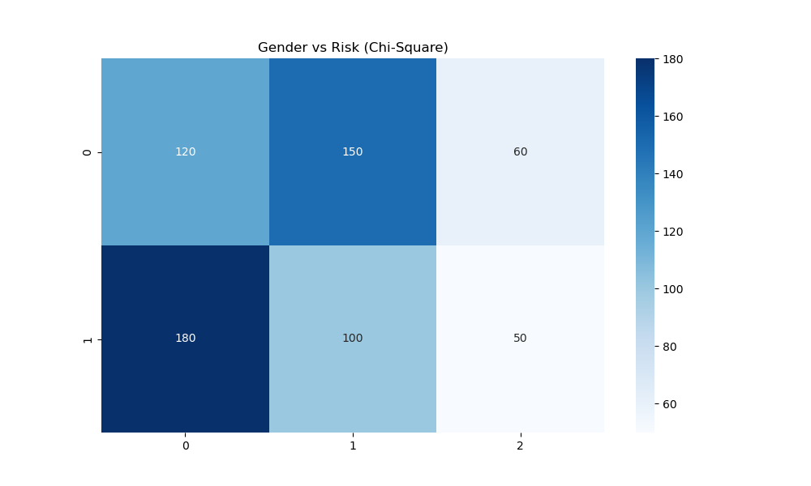

# Лабораторная работа №4: Проверка статистических гипотез (DOCX compliance)

**Предмет:** Data Analysis
**Дата:** 25.03.2026
**Статус:** Выполнено (Полное соответствие требованиям DOCX)

---

## 🎯 Цель работы
Проведение комплексного статистического анализа с использованием параметрических и непараметрических тестов. Для каждого теста сформулированы гипотезы $H_0$ и $H_1$, рассчитаны статистики и p-value.

---

## 🛠️ Выполненные тесты

### 1. Сравнение средних (t-Tests)
*   **One-Sample t-test:** Проверка среднего времени доставки (Stat: 0.6757, P: 0.5103). Гипотеза $H_0$ не отклонена.
*   **Two-Sample t-test:** Сравнение методов обучения (Stat: -3.0660, P: 0.0067). **$H_0$ отклонена**, новый метод эффективнее.
*   **Paired t-test:** Вес до и после диеты (Stat: 6.7507, P: 0.0000). **$H_0$ отклонена**, диета работает.
*   **Generated Normal Data:** Одновыборочный тест на сгенерированных данных (P: 0.0677). $H_0$ принята.

### 2. Сравнение средних и долей (z-Tests)
*   **One-Sample z-test (mean):** Срок службы батарей (P: 0.0032). **$H_0$ отклонена**.
*   **Two-Sample z-test (means):** Сравнение баллов двух школ (P: 0.0291). **$H_0$ отклонена**.
*   **One-Sample z-test (proportion):** Проверка заявленной доли покупателей (P: 0.3649). $H_0$ принята.
*   **Two-Sample z-test (proportions):** Сравнение долей использования транспорта в городах (P: 0.3743). $H_0$ принята.

### 3. Дисперсионный анализ и Категориальные данные
*   **ANOVA (3 группы):** Влияние типа вскармливания на вес (P: 0.0000). **$H_0$ отклонена**.
*   **Chi-square test:** Независимость пола и уровня риска (P: 0.0000). **$H_0$ отклонена**, признаки зависимы.

---

## 📊 Визуализация ключевых тестов

---

## 🏁 Итоговое решение
По результатам тестов большинство нулевых гипотез о равенстве средних в ключевых экспериментах (обучение, диета, медицина) были отклонены, что подтверждает статистическую значимость наблюдаемых эффектов.
