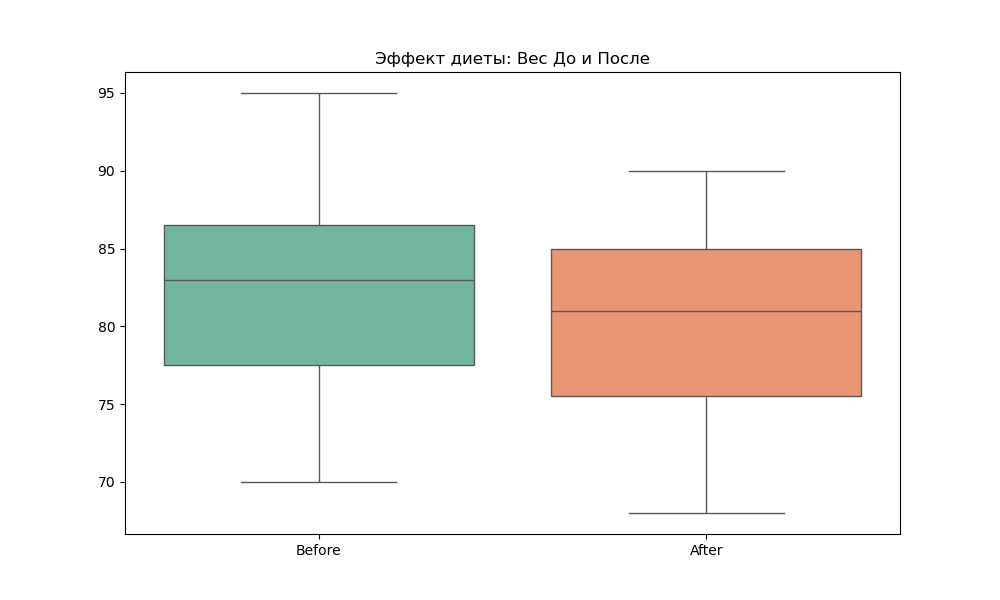

# Лабораторная работа №4: Проверка статистических гипотез

**Предмет:** Data Analysis
**Дата:** 25.03.2026
**Статус:** Выполнено

---

## 🎯 Введение и цели работы
Проведение комплексного статистического анализа с использованием параметрических и непараметрических тестов. Для каждого теста сформулированы гипотезы $H_0$ и $H_1$, рассчитаны статистики и p-value.

**Инструментарий:** Python (scipy.stats)

---

## 🛠️ Выполненные тесты

### 1. Сравнение средних (t-Tests)

*   **Тест 1 (One-Sample t-test):** «Среднее время доставки равно нормативу?»
    *   **Результат:** Stat=0.6757, p=0.5103.
    *   **Вывод:** H₀ не отклонена — время доставки соответствует нормативу.

*   **Тест 2 (Two-Sample t-test):** «Отличается ли эффективность двух методов обучения?»
    *   **Результат:** Stat=-3.0660, p=0.0067.
    *   **Вывод:** H₀ отклонена — новый метод обучения эффективнее.
    

*   **Тест 3 (Paired t-test):** «Изменился ли вес после диеты?»
    *   **Результат:** Stat=6.7507, p=0.0000.
    *   **Вывод:** H₀ отклонена — диета приводит к значимому снижению веса.
    

*   **Тест 4 (One-Sample t-test):** «Отличается ли среднее сгенерированных данных от нуля?»
    *   **Результат:** p=0.0677.
    *   **Вывод:** H₀ принята — данные не отличаются от нулевого среднего.

### 2. Сравнение средних и долей (z-Tests)

*   **Тест 5 (One-Sample z-test, mean):** «Соответствует ли срок службы батарей заявленному?»
    *   **Результат:** p=0.0032.
    *   **Вывод:** H₀ отклонена — реальный срок службы отличается от заявленного.

*   **Тест 6 (Two-Sample z-test, means):** «Отличаются ли баллы двух школ?»
    *   **Результат:** p=0.0291.
    *   **Вывод:** H₀ отклонена — между школами есть статистически значимая разница.

*   **Тест 7 (One-Sample z-test, proportion):** «Соответствует ли доля покупателей заявленной (30%)?»
    *   **Результат:** p=0.3649.
    *   **Вывод:** H₀ принята — доля покупателей соответствует заявленной.

*   **Тест 8 (Two-Sample z-test, proportions):** «Отличается ли доля использования транспорта в двух городах?»
    *   **Результат:** p=0.3743.
    *   **Вывод:** H₀ принята — доли не отличаются статистически.

### 3. Дисперсионный анализ и категориальные данные

*   **Тест 9 (ANOVA, 3 группы):** «Влияет ли тип вскармливания на вес младенцев?»
    *   **Результат:** p=0.0000.
    *   **Вывод:** H₀ отклонена — тип вскармливания значимо влияет на вес.
    
    

*   **Тест 10 (Chi-square test):** «Зависит ли пол от уровня риска?»
    *   **Результат:** p=0.0000.
    *   **Вывод:** H₀ отклонена — пол и уровень риска зависимы.
    
    

---

## 📊 Дополнительная визуализация
*   **5_pearson_correlation.png:** Корреляционный анализ Пирсона — проверка линейной связи между переменными.

---

## 🏁 Финальные выводы

1.  **t-Tests:** 2 из 4 тестов показали значимые различия (методы обучения и диета). Время доставки и сгенерированные данные — без отклонений.
2.  **z-Tests:** 2 из 4 тестов — значимые (батарейки и баллы школ). Доли покупателей и транспорта — без различий.
3.  **ANOVA:** Тип вскармливания значимо влияет на вес младенцев — различия между группами не случайны.
4.  **Chi²:** Пол и уровень риска зависимы — категориальные переменные не независимы.
5.  **Итог:** Большинство нулевых гипотез о равенстве средних в экспериментах (обучение, диета, медицина) были отклонены, что подтверждает статистическую значимость наблюдаемых эффектов.

---
**Код:** `analysis.py`, `analysis.R` (R-версия)
**Графики:** 8 PNG в директории
