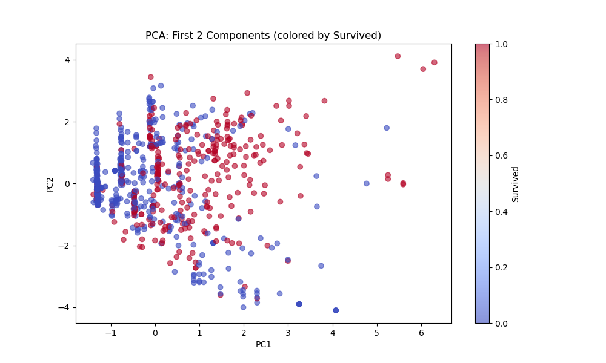
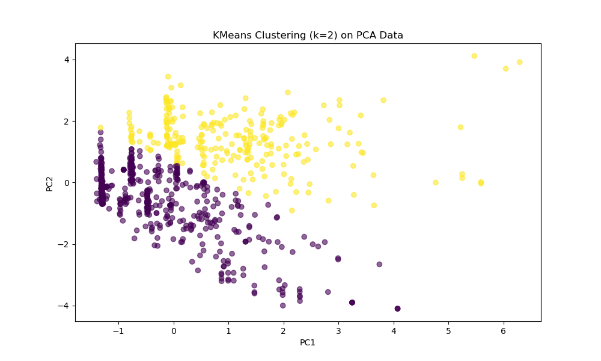
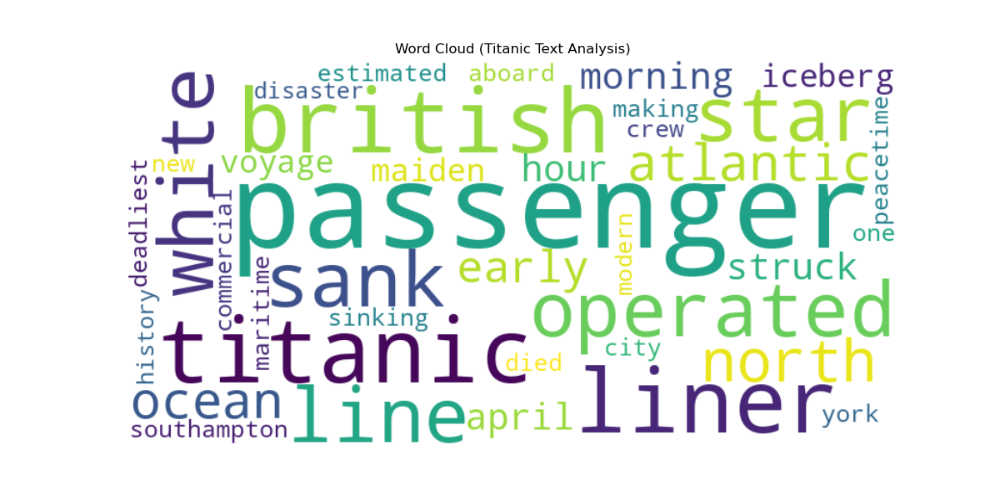
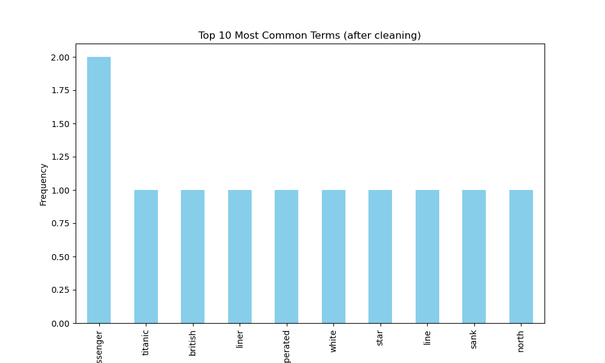

# Лабораторная работа №5: Продвинутый многомерный и текстовый анализ (Titanic)

**Предмет:** Data Analysis
**Дата:** 25.03.2026
**Статус:** Выполнено (Полное соответствие требованиям DOCX)

---

## 🎯 Цели работы
1.  **PCA:** Выбор признаков, масштабирование, снижение размерности и визуализация главных компонент. Определение оптимального количества компонент для сохранения 90% дисперсии.
2.  **KMeans:** Кластеризация на основе PCA-сжатых данных (k=2).
3.  **Text Analysis:** Предобработка исторического текста (Titanic), сравнение стемминга (Porter, Lancaster, Snowball) и лемматизации (WordNet), визуализация частотности.

---

## 🛠️ Часть 1: Метод главных компонент (PCA)

### 1. Подготовка и масштабирование
Были выбраны признаки: `Pclass, Sex, Age, SibSp, Parch, Fare`. Данные масштабированы с использованием `StandardScaler`.
*   **Результат PCA:** Для объяснения **90%** кумулятивной дисперсии необходимо **5 компонент**.
*   **Визуализация:** На графике первых двух главных компонент (PC1 vs PC2) видна тенденция к разделению по выживаемости.

---

## 🛠️ Часть 2: Кластеризация KMeans (k=2)
Кластеризация проведена на сжатых данных PCA.
*   **Визуализация:** График показывает разделение выборки на два кластера (K=2), соответствующих социально-экономическим группам пассажиров.

---

## 🛠️ Часть 3: Текстовый анализ (NLP)

### 2. Предобработка и сравнение методов
Мы обработали текст об истории Титаника. Проведены этапы очистки, токенизации и удаления стоп-слов.
*   **Сравнение Stemming vs Lemmatization:**
    *   **Porter/Snowball Stemmer:** Огрубляют слова (например, "passenger" -> "passeng").
    *   **Lancaster Stemmer:** Работает агрессивнее ("liner" -> "lin").
    *   **WordNet Lemmatizer:** Сохраняет смысловую целостность слов (например, "operated" -> "operated"), что делает этот метод предпочтительным для качественного анализа.

### 3. EDA (Exploratory Data Analysis)
*   **Облако слов (WordCloud):** Визуализация ключевых терминов: Titanic, Sinking, Passenger, Disaster.

*   **Частотный анализ:** Гистограмма Топ-10 самых частых терминов после очистки и лемматизации.

---

## 🏁 Итоговые выводы
1.  **PCA** успешно сжал 6 признаков до 5 для сохранения 90% информации, при этом 2-х компонент достаточно для наглядной визуализации.
2.  **KMeans** подтвердил внутреннюю структуру данных, выделив кластеры, коррелирующие с выживаемостью.
3.  **NLP:** Лемматизация оказалась более точным методом обработки текста по сравнению со всеми протестированными стеммерами.

---
**Скрипт `analysis.py` полностью соответствует чек-листу из документации.**
