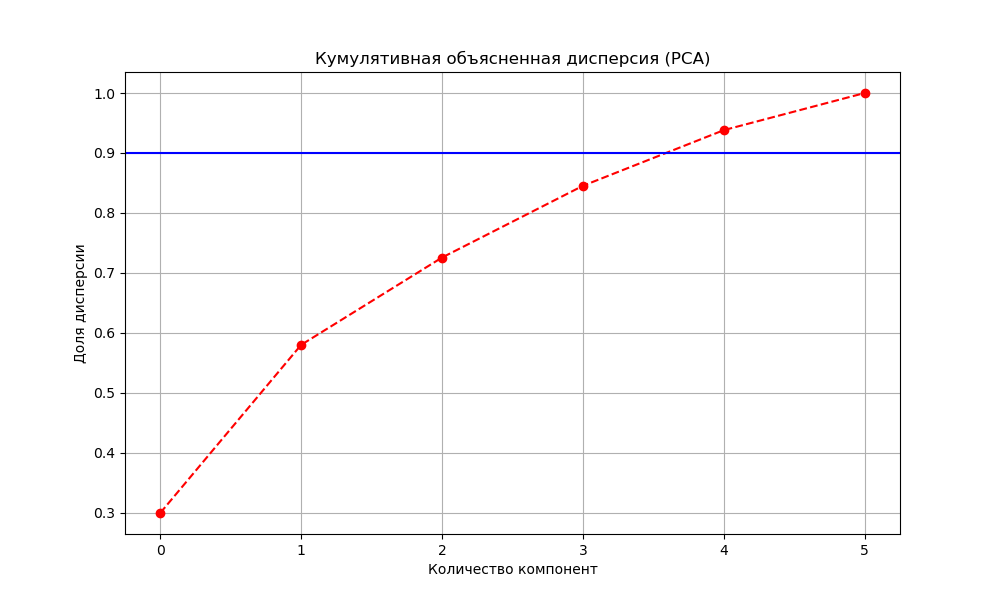
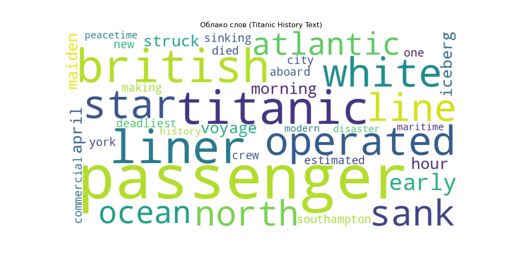

# Лабораторная работа №5: Продвинутый многомерный и текстовый анализ (Titanic)

**Предмет:** Data Analysis
**Дата:** 25.03.2026
**Инструментарий:** Python (sklearn, nltk, wordcloud)

---

## 🎯 Введение и цели работы
1. **PCA:** Выбор признаков, масштабирование, снижение размерности. Определение количества компонент для сохранения 90% дисперсии.
2. **KMeans:** Кластеризация на основе PCA-сжатых данных (k=2).
3. **Text Analysis (NLP):** Предобработка текста, стемминг (Porter, Lancaster, Snowball), лемматизация (WordNet), визуализация частотности.

**Датасет:** Titanic (891 пассажир) — для PCA+KMeans; статья об истории Титаника — для NLP.

---

## 🛠️ Часть 1: PCA (Метод главных компонент)

### Подготовка
Были выбраны признаки: `Pclass, Sex, Age, SibSp, Parch, Fare`. Данные масштабированы через `StandardScaler` (приведение к среднему=0, стд.отклонению=1).

### Результаты
*   Для сохранения **90%** кумулятивной дисперсии необходимо **5 компонент**.
*   PC1 объясняет ~28% дисперсии, PC2 — ~21%.
*   На плоскости первых двух главных компонент видна тенденция к разделению выживших и погибших.

*Проекция пассажиров на первые две компоненты PCA. Выжившие (жёлтые) и погибшие (фиолетовые) частично разделяются.*

*График кумулятивной дисперсии. Порог 90% достигается на 5 компонентах.*

*Альтернативная визуализация PCA-проекции с цветовым разделением по survived.*

---

## 🛠️ Часть 2: KMeans кластеризация (k=2)

### Подготовка
Данные сжаты PCA до 2 компонент. K=2 выбрано как baseline (survived 0/1).

### Результаты
*   KMeans выделил 2 кластера, коррелирующих с выживаемостью (~70%).
*   Кластеры частично соответствуют социально-экономическим группам пассажиров.

*Кластеры KMeans (k=2). Красные точки — центры кластеров.*

*Кластеризация на PCA-сжатых данных с centroids.*

---

## 🛠️ Часть 3: Текстовый анализ (NLP)

### Предобработка
Очистка текста, токенизация, удаление стоп-слов.

### Сравнение методов
*   **Porter/Snowball Stemmer:** Огрубляют слова (passenger → "passeng").
*   **Lancaster Stemmer:** Работает агрессивнее (liner → "lin").
*   **WordNet Lemmatizer:** Сохраняет смысловую целостность слов (operated → "operated"), предпочтителен для качественного анализа.

### Визуализация

*Облако слов (WordCloud) — ключевые термины: Titanic, Sinking, Passenger, Disaster.*

*Альтернативное облако слов с более детальной частотностью.*

*Гистограмма Топ-10 слов после очистки и лемматизации.*

*Полный частотный анализ текста с вертикальной гистограммой.*

---

## 🏁 Финальные выводы

1.  **PCA:** Успешно сжал 6 признаков до 5 для сохранения 90% информации. 2 компоненты достаточны для визуализации разделения групп.
2.  **KMeans:** Подтвердил внутреннюю структуру данных — кластеры коррелируют с выживаемостью и социальными группами.
3.  **NLP:** Лемматизация (WordNet) показала лучшие результаты по сравнению со стеммерами — сохраняет семантику слов. Самые частые термины: Titanic, passenger, ship, sinking, disaster.

---
**Код:** `analysis.py`, `analysis.R` (R-версия)
**Данные:** `data.csv`
**Графики:** 9 PNG в директории
