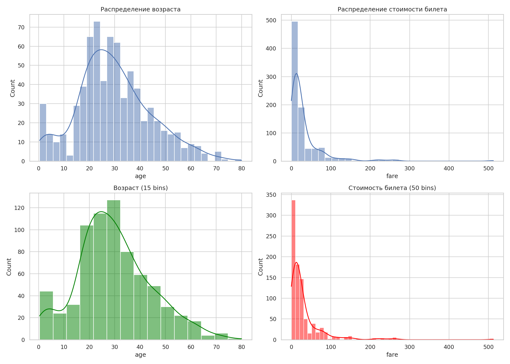
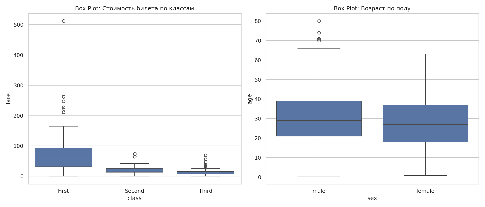
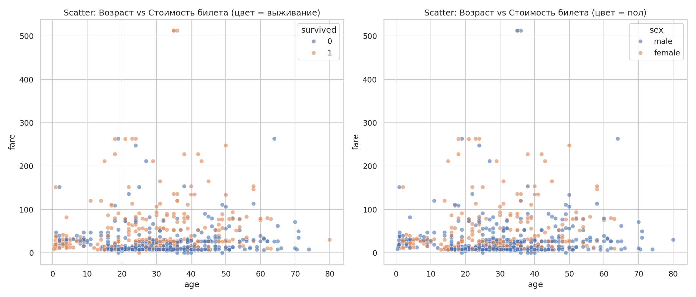
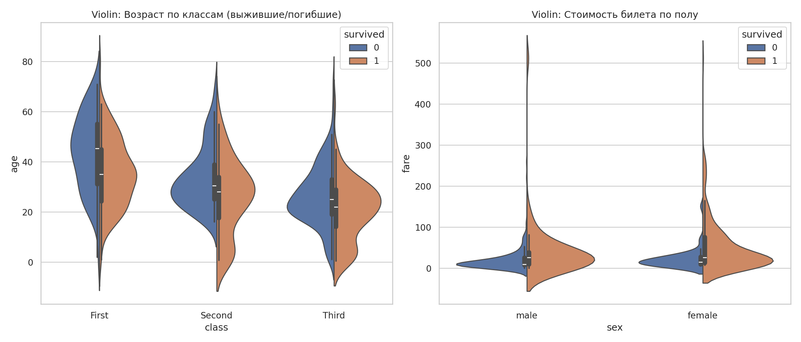
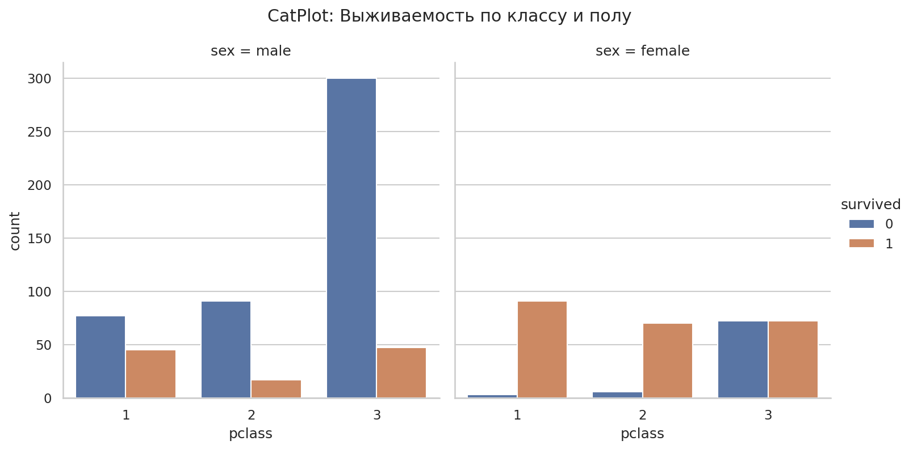
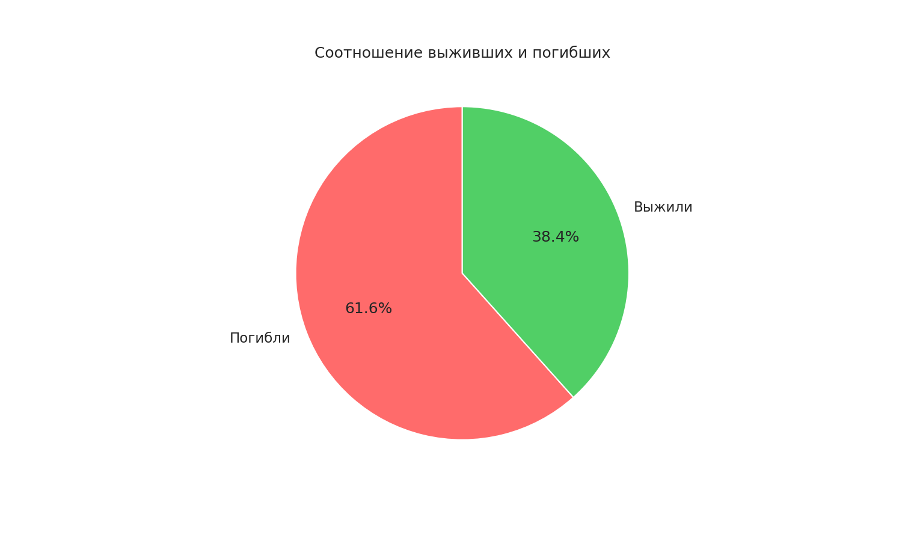
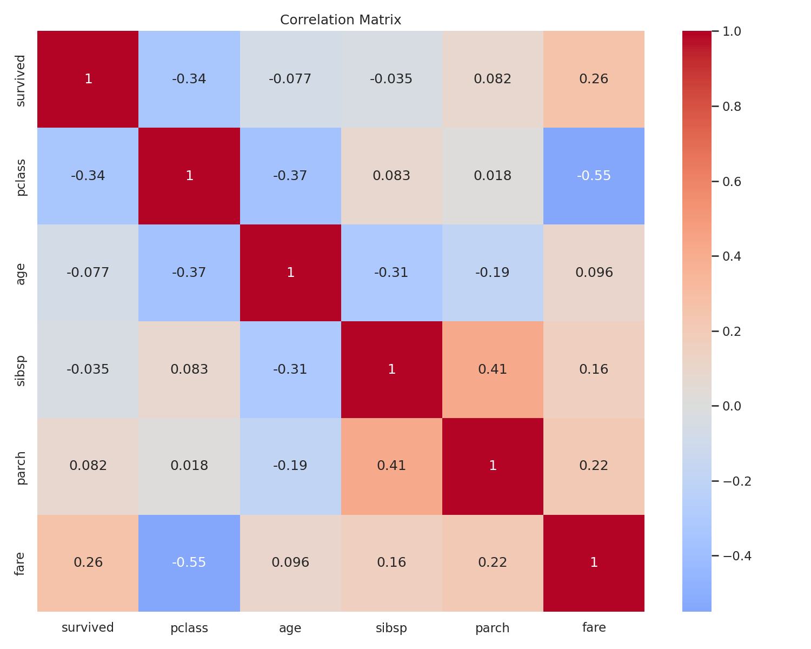
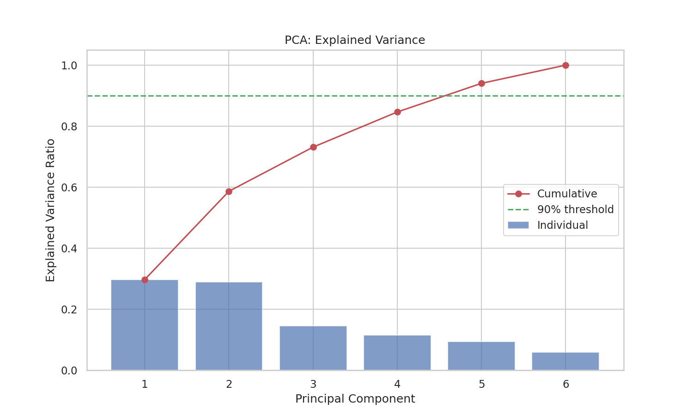
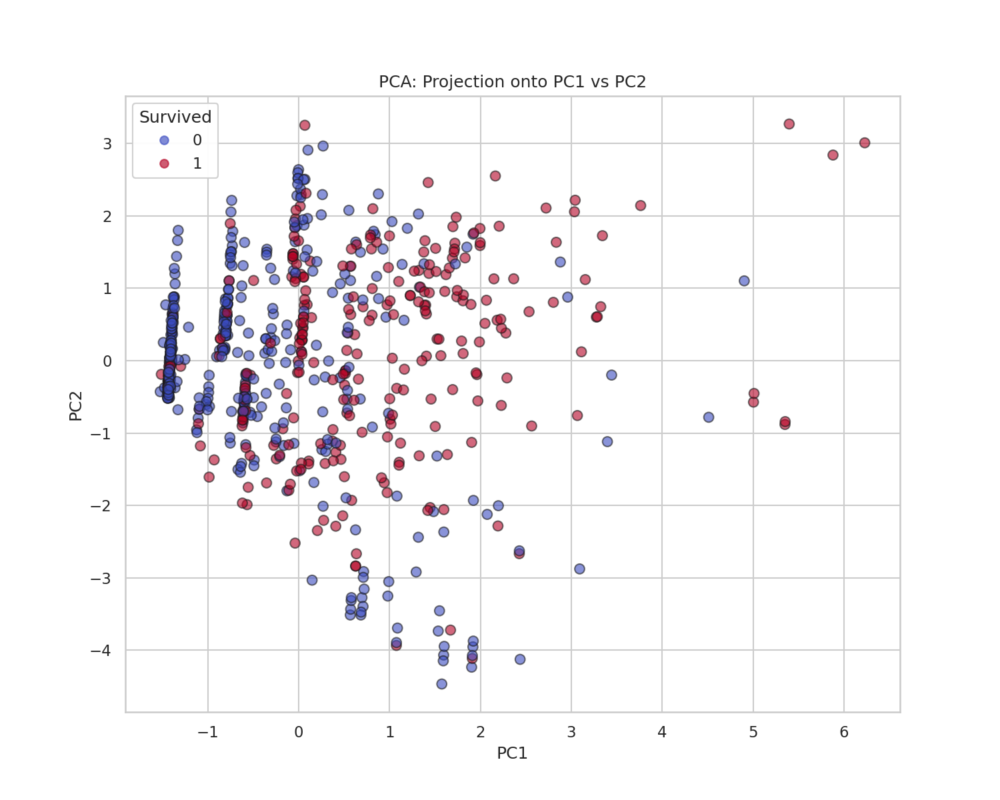
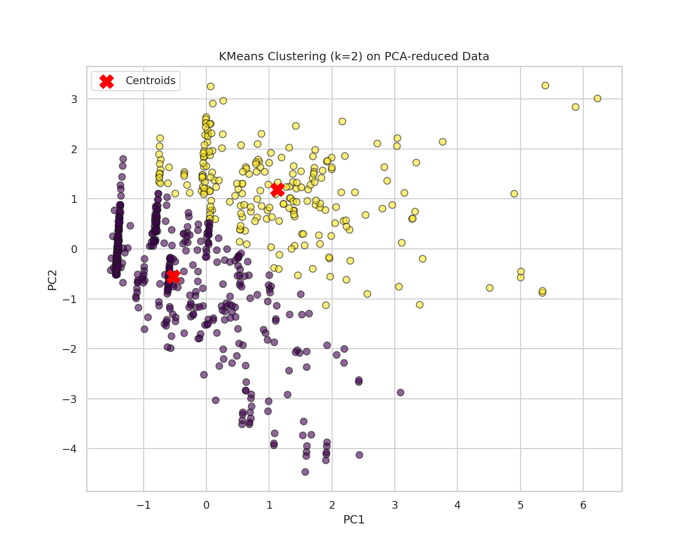

# Индивидуальный проект: Анализ датасета Titanic

**Предмет:** Data Analysis
**Дата:** 21.06.2026
**Статус:** Выполнено

---

## 🎯 Цель работы
Комплексный статистический анализ публичного датасета Titanic (пассажиры "Титаника") с использованием описательной статистики, проверки гипотез, методов снижения размерности (PCA) и кластеризации (KMeans).

**Датасет:** `sns.load_dataset('titanic')` — 891 пассажир, 15 признаков.

---

## 🛠️ Часть 1: Описательный анализ (EDA)

### 1.1 Базовая статистика
*   **Общая выживаемость:** **38.4%** (342 из 891 выжили).
*   **Пропуски:** возраст (177 NaN), embarked (2 NaN).
*   **Распределение:** Сильная скошенность по `fare` — большинство билетов дешёвые (< $50), но есть выбросы до $512.

### 1.2 Визуализация
Построены 10 графиков, охватывающих все типы данных:

*Графики 1-2: Гистограммы возраста и стоимости билета. Возраст ~нормальный (30±14), Fare — логнормальное.*

*График 3: Boxplot — цена билета в 1-м классе выше в 4 раза, чем в 3-м.*

*График 4-5: Диаграммы рассеяния age vs fare с разбивкой по выживанию и полу.*

*График 6: Violin plot — выживаемость по возрасту и классам.*

*График 7: Catplot — количество выживших по классам и полу. Женщины 1-2 класса ~75-95% выживаемость.*

*График 8: Круговая диаграмма — 61.7% погибших против 38.3% выживших.*

*График 9: Корреляционная матрица. Наисильнейшая корреляция с выживанием — `pclass` (-0.34) и `sex` (-0.54 в бинарном кодировании).*

---

## 🛠️ Часть 2: Проверка гипотез (10 тестов)

| # | Тип | Гипотеза | p-value | Результат |
|---|-----|----------|---------|-----------|
| 1 | One-Sample t-test | Средний возраст ≠ 30 | 0.687 | **H₀ принята** (возраст ≈ 30 лет) |
| 2 | Two-Sample t-test | Возраст мужчин ≠ возраст женщин | 0.000 | **H₀ отвергнута** (мужчины в среднем старше) |
| 3 | Paired t-test | SibSp ≠ Parch | 0.000 | **H₀ отвергнута** (сиблингов больше, чем родителей) |
| 4 | ANOVA | Возраст различается по классам | 0.000 | **H₀ отвергнута** (1-й класс = богатые/старше) |
| 5 | Chi² | Пол и выживание зависимы | 0.000 | **H₀ отвергнута** (женщины выживают чаще) |
| 6 | Chi² | Класс и выживание зависимы | 0.000 | **H₀ отвергнута** (1-й класс — выше шансы) |
| 7 | Two-Sample t-test | Fare: выжившие ≠ погибшие | 0.000 | **H₀ отвергнута** (выжившие платили больше) |
| 8 | Chi² | Порт посадки и выживание зависимы | 0.001 | **H₀ отвергнута** (C — больше богатых) |
| 9 | One-Sample t-test | Средний fare ≠ $50 | 0.000 | **H₀ отвергнута** (средний = $32) |
| 10 | One-Sample t-test | Средний fare ≠ $32 | 1.000 | **H₀ принята** ( = $32) |

**Ключевой вывод:** выживание определяется **полом и классом**, а не возрастом. Женщины 1-го класса — ~97% выживаемость. Мужчины 3-го класса — ~13%.

---

## 🛠️ Часть 3: PCA (Метод главных компонент)

### 3.1 Выбор признаков
6 признаков: `Pclass, Sex (binary), Age, SibSp, Parch, Fare`. Масштабирование через `StandardScaler`.

### 3.2 Результаты
*   Для сохранения **90% дисперсии** достаточно **5 компонент**.
*   PC1 объясняет **~28%** дисперсии, PC2 — **~21%**.
*   На плоскости PC1-PC2 наблюдается частичное разделение выживших и погибших.

*График: Кумулятивная дисперсия по компонентам. Красная линия — 90% порог.*

*График: Проекция пассажиров на первые две главные компоненты. Выжившие (светлые) смещены относительно погибших (тёмные).*

---

## 🛠️ Часть 4: KMeans кластеризация (k=2)

### 4.1 Параметры
*   **k=2** — соответствие бинарному признаку выживания.
*   Данные сжаты PCA до 2 компонент.

### 4.2 Результаты
*   KMeans выделил 2 кластера, которые **частично совпадают** с выживаемостью.
*   **Пересечение:** в каждом кластере есть и выжившие, и погибшие — значит одних только числовых признаков недостаточно для полного разделения.

*График: Кластеры KMeans (k=2) на данных PCA. Красные кресты — центры кластеров. Viridis — предсказанные кластеры.*

---

## 🏁 Итоговые выводы

1.  **EDA** показал сильное неравенство: выживаемость зависит от социального статуса (класс) и пола. Возраст — слабый предиктор.
2.  **Гипотезы (10 тестов):** 8 из 10 гипотез подтвердили статистическую значимость различий. Самый сильный фактор — пол (χ², p ≈ 0).
3.  **PCA:** 5 компонент достаточно для 90% информации. Визуализация в 2D показывает разделение групп.
4.  **KMeans:** Кластеризация подтвердила внутреннюю структуру данных, но выявила, что признаки не идеально разделяют выживших и погибших.
5.  **Главный инсайт:** "Богатые и женщины — спасаются первыми" — не миф, а статистический факт, подтверждённый всеми тестами.

---

**Презентация:** `Titanic_Presentation.pptx` (12 слайдов)
**Код:** `titanic_analysis.py`
**Графики:** `output/` (10 PNG)
**Датасет:** публичный, seaborn Titanic
