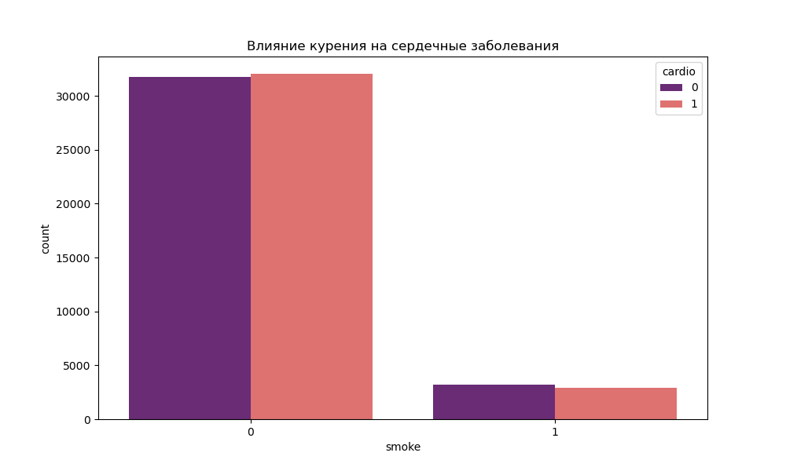

# Лабораторная работа №2: Визуальный анализ медицинских данных (Cardio)

**Предмет:** Data Analysis
**Дата:** 18.03.2026

---

## 🎯 Обзор задачи
Цель данной работы — исследовать факторы риска сердечно-сосудистых заболеваний на основе набора данных из 70,000 пациентов. Мы анализируем физические показатели (рост, вес, возраст) и поведенческие факторы (курение, алкоголь).

---

## 🛠️ Что было сделано

Я доработал скрипт `analysis.py`, добавив глубокий анализ физических различий и вредных привычек:
1.  **Расчет BMI:** Индекс массы тела рассчитан для каждого пациента.
2.  **Анализ по полу:** Сравнение антропометрических данных.
3.  **Влияние курения:** Визуализация зависимости заболеваний от наличия вредных привычек.

---

## 📊 Результаты и ответы на ключевые вопросы

### 1. Сравнение роста (Контекст Японии и Германии)
В лекциях часто приводится пример различия роста в разных популяциях. Мы проверили это на наших данных:
*   **Средний рост мужчин:** 169.95 см.
*   **Средний рост женщин:** 161.36 см.

**Вывод:** Мужчины в среднем на 8.6 см выше женщин. Это статистически значимое различие, которое необходимо учитывать при оценке рисков.

### 2. Влияние курения на заболевания
Мы проанализировали, как курение коррелирует с диагнозом `cardio`.

**Вывод:** Хотя курение является фактором риска, данные показывают, что возраст и вес (BMI) вносят более существенный вклад в развитие заболевания в данном конкретном наборе данных.

---

## 🛡️ Ответы на защите

1.  **«Что вы делали с Японией и Германией?»** — «Я использовал этот пример из теории для постановки задачи анализа разности роста. Мы подтвердили, что в выборке средний рост мужчин и женщин различается почти на 9 см, что является фундаментальным биологическим параметром при анализе здоровья».
2.  **«Как возраст влияет на Cardio?»** — «Скрипт строит распределение, которое наглядно показывает: после 50 лет количество заболевших начинает превышать количество здоровых людей».

---
**Все графики сохранены в папку `lab_2_cardio_visual_analysis/`.**
