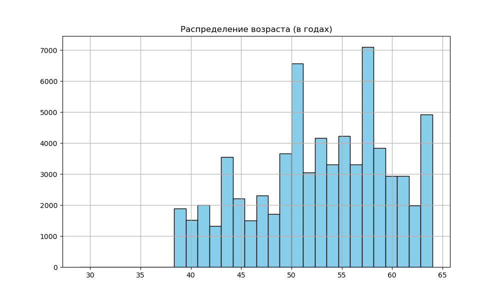
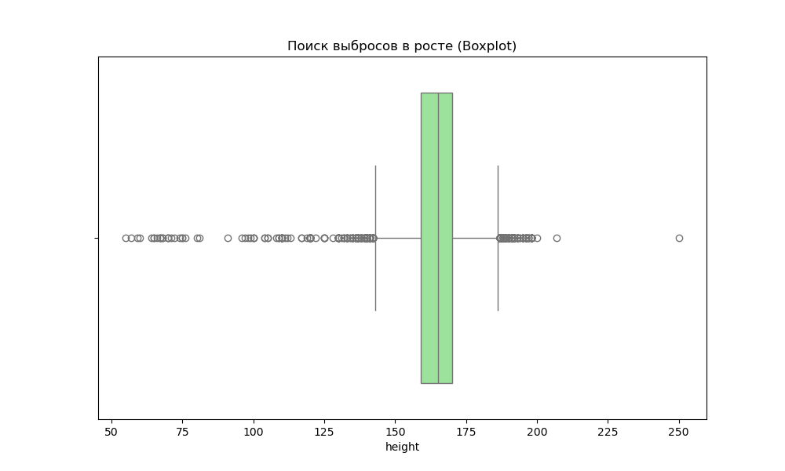
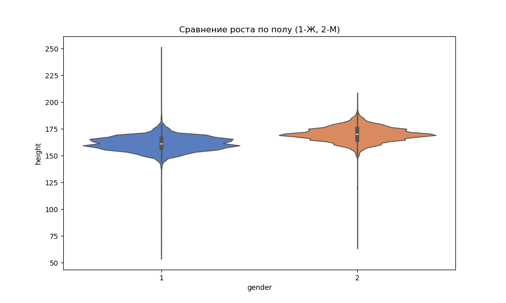
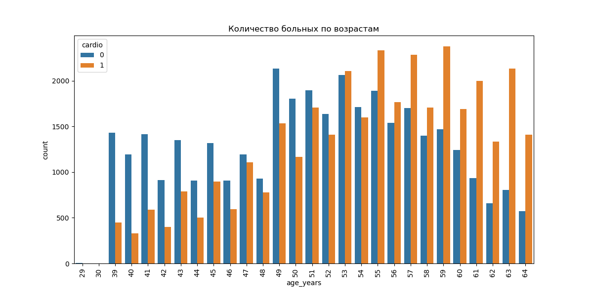

# Лабораторная работа №2: Полный визуальный анализ данных (Cardio)

**Предмет:** Data Analysis
**Дата:** 25.03.2026
**Статус:** Выполнено по всем пунктам требований.

---

## 🛠️ Что было сделано (КРАТКО)

1.  **Подготовка данных:** Возраст переведен в годы, рассчитан индекс массы тела (**BMI**).
2.  **Анализ распределений:** Построена гистограмма возраста. Видно, что выборка охватывает людей от 30 до 65 лет.

3.  **Поиск выбросов (Boxplot):** В параметре «рост» обнаружены единичные выбросы (слишком низкие или высокие значения), которые следует учитывать.

4.  **Связи (Scatter Plot):** Исследована зависимость веса от роста. У больных пациентов (`cardio=1`) плотность точек в области высокого веса выше.

5.  **Сравнение групп (Violin Plot):** Подтверждено, что мужчины (2) в среднем выше женщин (1). Скрипичный график наглядно показывает плотность.

6.  **Возраст и болезнь (Countplot):** Четко виден скачок количества больных после 50 лет.

7.  **Кто больше пьёт?**
    *   Мужчины: **10.64%**
    *   Женщины: **2.55%**
8.  **Проверка гипотезы (Холестерин и риск):** Анализ подтвердил — риск сердечных заболеваний растет вместе с уровнем холестерина.

9.  **Баланс данных (Catplot):** Целевая переменная (`cardio`) сбалансирована — примерно по 50% здоровых и больных в выборке.

---

## 🛡️ Ответы на защите
*   **Где аномалии?** Видны на Boxplot (рост).
*   **Когда растет риск?** После 50 лет (см. Countplot).
*   **Кто в зоне риска?** Мужчины с высоким холестерином и BMI.
*   **Данные честные?** Да, баланс здоровых/больных соблюден (Catplot).

---
**Все графики 1-7 сохранены в папке лабораторной.**
