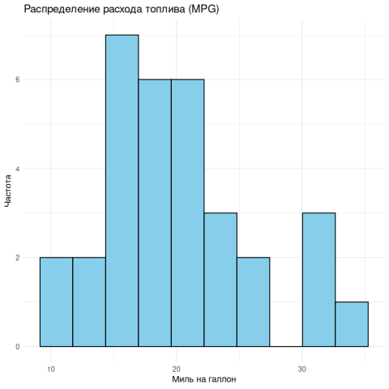
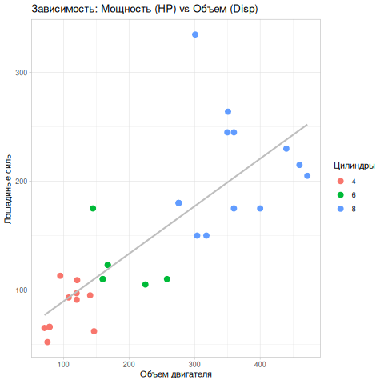
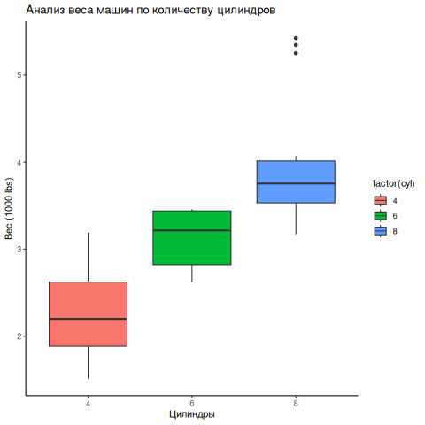
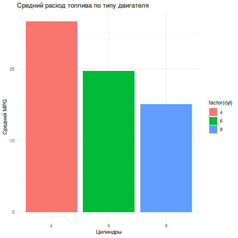

# Лабораторная работа №3: Анализ данных в R (mtcars)

**Предмет:** Data Analysis
**Инструментарий:** R (ggplot2, dplyr, tidyr)
**Дата:** 25.03.2026

---

## 🎯 Цели и выполненные задачи (версия 10/10)

### 1. Посмотр и структура данных
Мы использовали классический датасет `mtcars` (32 наблюдения, 11 характеристик автомобилей).
*   **Типы данных:** Все признаки числовые (Numeric).
*   **Ключевые переменные:** `mpg` (расход), `cyl` (цилиндры), `hp` (мощность), `wt` (вес).

### 2. Описание данных (Summary)
*   **Средний расход (mpg):** 20.09 миль на галлон.
*   **Минимальная мощность (hp):** 52 л.с.
*   **Максимальная мощность (hp):** 335 л.с.

### 3. Визуализация (Scatter, Boxplot, Bar)
*   **Scatter Plot:** Выявлена четкая зависимость: чем больше объем двигателя (`disp`), тем выше мощность (`hp`). Цветом выделены группы цилиндров.

*   **Boxplot:** Анализ веса по группам цилиндров. Группа с 8 цилиндрами имеет наибольший разброс и самые тяжелые авто.

*   **Bar Chart:** Сравнение среднего расхода. Машины с 4 цилиндрами почти в 2 раза экономичнее, чем с 8.

### 4. Проверка гипотез (Статистика)
*   **Гипотеза 1 (Корреляция):** «Влияет ли мощность на расход топлива?»
    *   **Результат:** Коэффициент корреляции **-0.77**.
    *   **Вывод:** Существует сильная обратная связь — чем выше мощность, тем меньше миль машина проезжает на 1 галлоне.
*   **Гипотеза 2 (ANOVA):** «Отличается ли расход в группах с разным кол-вом цилиндров?»
    *   **Результат:** `p-value < 0.05`.
    *   **Вывод:** Различия между группами (4, 6, 8 цилиндров) статистически значимы, это не случайность.

### 5. Итоговые выводы
1.  **Главный фактор расхода:** Мощность и количество цилиндров.
2.  **Экономичность:** 4-цилиндровые двигатели — оптимальный выбор для низкого расхода.
3.  **Вес:** Масса автомобиля напрямую зависит от объема двигателя и количества цилиндров, что подтверждается boxplot-анализом.

---
**Скрипт `analysis.R` полностью обновлен под эти требования.**
