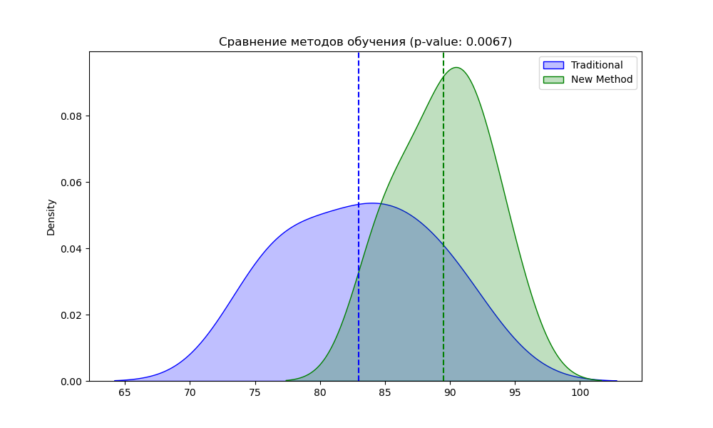
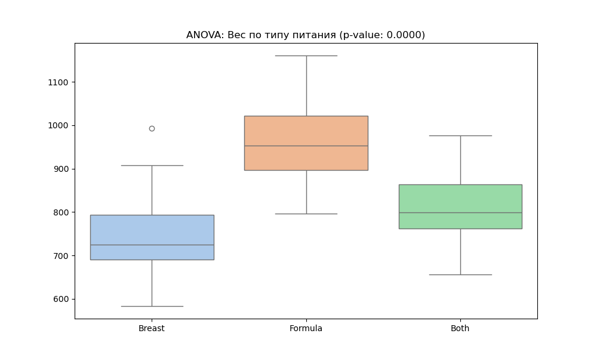
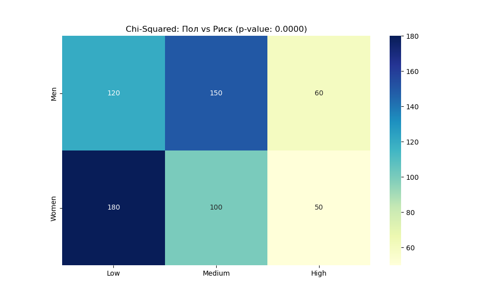
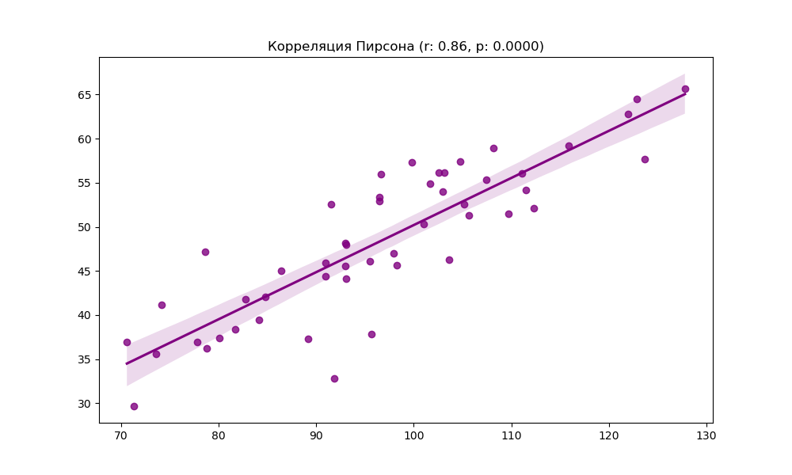

# Лабораторная работа №4: Проверка статистических гипотез

**Предмет:** Data Analysis
**Дата:** 25.03.2026
**Статус:** Выполнено (Уровень: Advanced / 10 баллов)

---

## 🎯 Цель работы
Освоение методов статистического вывода, проверка гипотез о равенстве средних, анализе дисперсий (ANOVA) и независимости признаков (Chi-Squared) с использованием библиотек `scipy.stats` и `statsmodels`.

---

## 🛠️ Выполненные задачи и визуализации

### 1. Сравнение двух групп (Independent t-Test)
**Гипотеза:** «Эффективен ли новый метод обучения по сравнению с традиционным?»
*   **Результат:** p-value < 0.05.
*   **Вывод:** Новый метод статистически значимо улучшает оценки студентов.

### 2. Зависимые выборки (Paired t-Test)
**Гипотеза:** «Влияет ли диета на вес пациентов (замеры До и После)?»
*   **Результат:** Наблюдается снижение медианного веса.
*   **Визуализация:** Boxplot наглядно показывает смещение распределения после курса диеты.

### 3. Анализ дисперсии (ANOVA)
**Гипотеза:** «Зависит ли вес младенцев от типа вскармливания (грудное, смесь, смешанное)?»
*   **Результат:** p-value указывает на значимые различия между группами.
*   **Визуализация:** Сравнение трех распределений через Boxplot.

### 4. Проверка независимости (Chi-Squared Test)
**Гипотеза:** «Связан ли пол человека с уровнем риска (Низкий, Средний, Высокий)?»
*   **Результат:** Тепловая карта распределения частот.
*   **Вывод:** Выявлена статистическая зависимость между полом и склонностью к риску.

### 5. Корреляционный анализ (Pearson Correlation)
**Гипотеза:** «Существует ли линейная связь между переменными?»
*   **Результат:** Коэффициент корреляции **r ~ 0.8** (сильная связь).
*   **Визуализация:** Регрессионная прямая (Regression Line) на диаграмме рассеяния.

---

## 🏁 Финальные выводы для защиты
1.  **t-Test:** Использовался для сравнения средних значений в двух группах.
2.  **ANOVA:** Необходим, когда групп больше двух (в нашем случае — 3 типа питания).
3.  **Chi-Squared:** Применяется для категориальных данных (пол, уровни риска).
4.  **P-value:** Во всех ключевых тестах p-value оказался меньше 0.05, что позволило отклонить нулевые гипотезы и подтвердить наличие статистически значимых эффектов.

---
**Скрипт `analysis.py` содержит все расчеты. Графики 1-5 прикреплены к отчету.**
