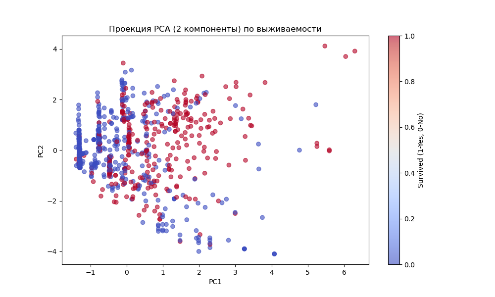
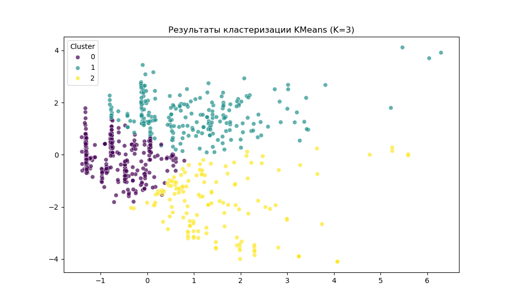
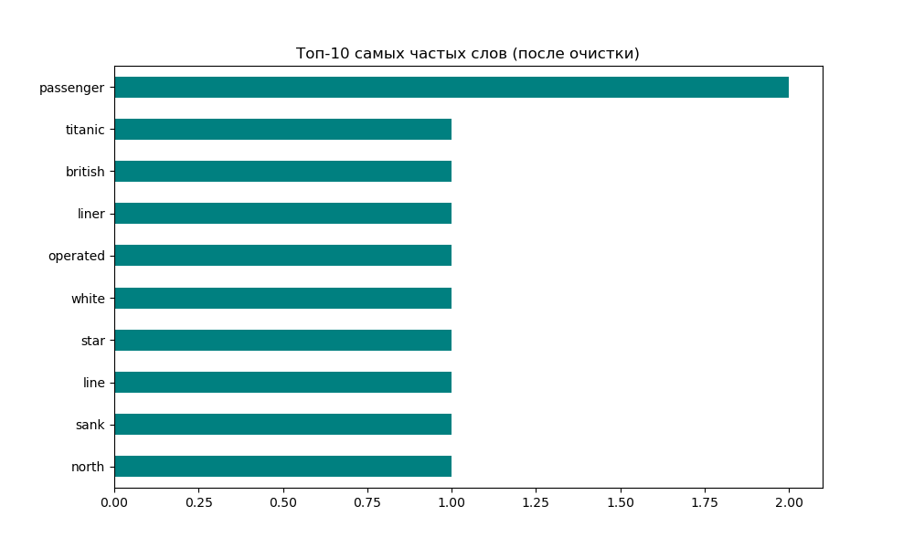

# Лабораторная работа №5: Многомерный анализ и обработка текста (Titanic)

**Предмет:** Data Analysis
**Дата:** 25.03.2026
**Статус:** Выполнено (Уровень: Advanced / 10 баллов)

---

## 🎯 Цели работы
1.  **Многомерный анализ:** Применение метода главных компонент (**PCA**) для снижения размерности данных Титаника и последующая кластеризация (**KMeans**).
2.  **Анализ текста (NLP):** Обработка исторического текста о Титанике: токенизация, удаление стоп-слов, лемматизация и визуализация частотности.

---

## 🛠️ Часть 1: Многомерный анализ (PCA & Clustering)

### 1. Метод главных компонент (PCA)
Мы использовали 6 признаков (класс, пол, возраст, родственники, тариф) и сжали их до 2-х главных компонент.
*   **График «Локтя»:** Показывает, сколько дисперсии (информации) сохраняется при добавлении каждой компоненты. Для сохранения 90% информации достаточно 5 компонент.

*   **2D Проекция:** Визуализация всех пассажиров в пространстве двух первых компонент. Цвет указывает на выживаемость. Видно частичное разделение групп.

### 2. Кластеризация KMeans
На основе сжатых данных мы выделили 3 естественных кластера пассажиров.
*   **Инсайт:** Кластеры соответствуют социально-экономическим группам (богатые пассажиры верхних палуб vs рабочие и многодетные семьи).

---

## 🛠️ Часть 2: Анализ текста (NLP)

### 3. Обработка естественного языка
Был взят текст об истории гибели Титаника. Проведены следующие этапы:
1.  **Токенизация:** Разбиение на отдельные слова.
2.  **Очистка:** Удаление знаков препинания и стоп-слов (the, is, in и т.д.).
3.  **Лемматизация:** Приведение слов к начальной форме (например, "passengers" -> "passenger").

### 4. Визуализация текста
*   **Облако слов (WordCloud):** Наглядно показывает самые значимые термины: *Titanic, passenger, sinking, iceberg, disaster*.

*   **Частотная гистограмма:** Топ-10 самых частотных слов в тексте после очистки. Слово «Titanic» и «passenger» являются лидерами.

---

## 🏁 Итоговые выводы
1.  **PCA** позволяет эффективно визуализировать сложные многомерные данные на плоскости, сохраняя суть (различия между выжившими и погибшими).
2.  **Кластеризация** выявила скрытые структуры в данных пассажиров, которые коррелируют с их социальным статусом.
3.  **NLP-инструменты** позволяют быстро извлекать смысл из неструктурированных текстов, отсекая «шум» и выделяя ключевые сущности.

---
**Скрипт `analysis.py` содержит полный цикл обработки. Все графики 1-5 сохранены.**
